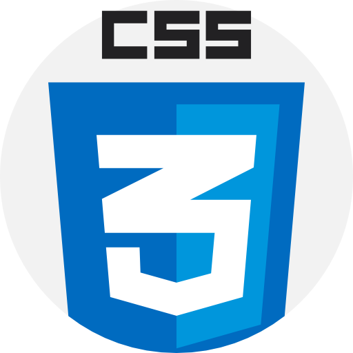

# Aurora_ADS_2026-01
# 🏢 Aurora

---

## 📚 Disciplina
**Nome da disciplina:Desenvolvimento Ágil**  
**Semestre:** 2026/1

---

## 👥 Integrantes do Grupo

| Foto | Nome | GitHub |
|------|------|--------|
|  | Arthur Gabriel Teotonio Stellato | [github.com/Yakino41](https://github.com/Yakino) |
|  | Conrado Henrique Lima Da Mata | [github.com/usuario](https://github.com/usuario) |
|  | João Aleixo Melo | [github.com/usuario](https://github.com/usuario) |
|  | Reinan Cordeiro Morais | [github.com/usuario](https://github.com/usuario) |

---

## 📖 Sobre o Projeto

### 🎯 Objetivo
Conscientizar a população sobre a importância da doação de móveis e o impacto positivo que essa prática pode gerar na vida de famílias de baixa renda.

### ⚙️ Funcionalidades Principais
- Cadastro de doadores
- Listagem de móveis disponíveis para doação
- Informações educativas sobre o impacto social da doação

### 👤 Público-Alvo
Pessoas interessadas em doar móveis, bem como famílias de baixa renda que necessitam desses itens para melhorar sua qualidade de vida.

---

## 📂 Documentação do Projeto

Aqui você encontra todos os documentos relacionados ao projeto:

- 📄 [Requisitos Funcionais](./docs/requisitos-funcionais.md)
- 📄 [Requisitos Não Funcionais](./docs/requisitos-nao-funcionais.md)
- 📄 [Casos de Uso](./docs/casos-de-uso.md)
- 📄 [Diagrama de Classes](./docs/diagrama-classes.md)
- 📄 [Diagrama de Sequência](./docs/diagrama-sequencia.md)
- 📄 [Manual do Usuário](./docs/manual-usuario.md)

---

## 🚀 Tecnologias Utilizadas
- Linguagem:      
- Framework: 
- Outros:

---

## 📌 Status do Projeto
🚧 Em desenvolvimento
